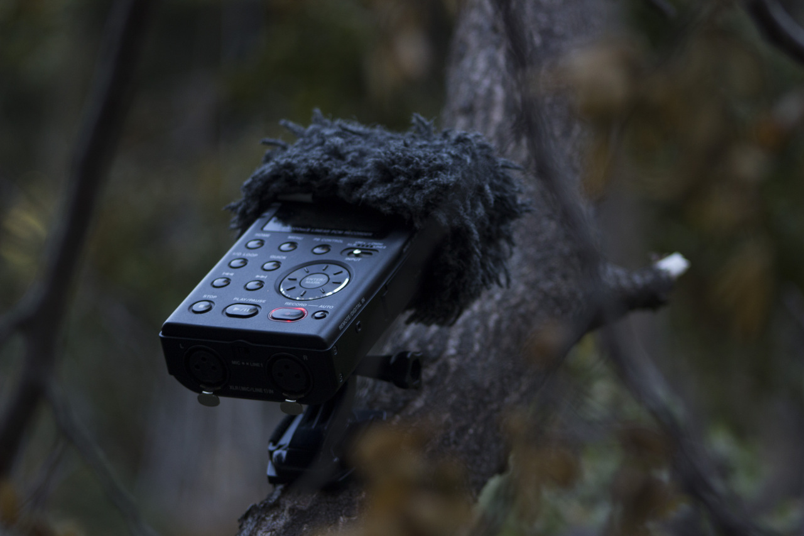
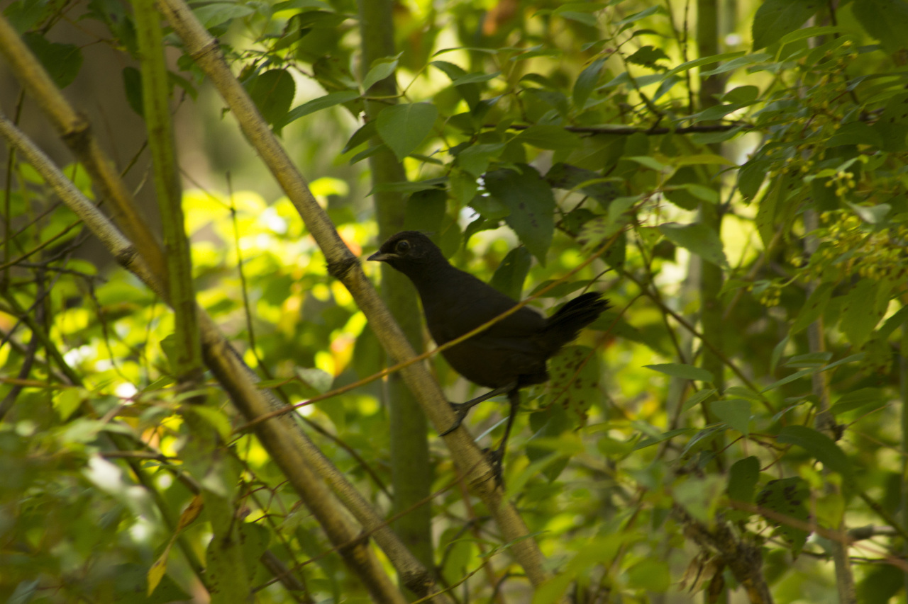
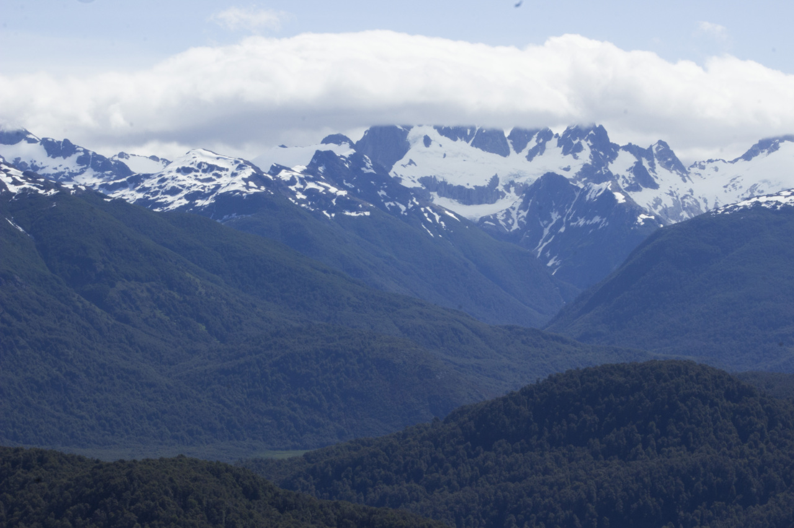

Language:

****

## Alerces
### 2023

_Alerces_ is a collection of field recordings made in Los Alerces National Park, a territory of great importance for the conservation of the natural and cultural heritage of the Patagonian ecosystems. Birds, insects, native and exotic vegetation, wind, and water in different environments are some of the representatives of the soundscapes of this territory. The Andes mountain range divides waters that cross the steppe to the east to reach the Atlantic Ocean and others that will find their way through the mountains to reach the Pacific Ocean. Water is pervasive in all landscapes, creating a multitude of sounds depending on the textures it encounters along the way. This album was made possible thanks to the Artistic Residencies in National Parks program of the National Parks Administration and the Ministry of Culture of Argentina (2022).

****

#### Bandurrias

img src="https://ik.imagekit.io/ikmedia/backlit.jpg" 
	 style="object-fit:contain;
            width:200px;
            height:300px;
            border: solid 1px #CCC"/

<iframe style="border: 0; width: 100%; height: 42px;" src="https://bandcamp.com/EmbeddedPlayer/album=469038166/size=small/bgcol=ffffff/linkcol=0687f5/track=2611238221/transparent=true/" seamless><a href="https://pepiamodeo.bandcamp.com/album/alerces">Alerces by Pepi Amodeo</a></iframe>

<iframe style="border: 0; width: 100%; height: 42px;" src="https://bandcamp.com/EmbeddedPlayer/album=469038166/size=small/bgcol=ffffff/linkcol=0687f5/track=1818603113/transparent=true/" seamless><a href="https://pepiamodeo.bandcamp.com/album/alerces">Alerces by Pepi Amodeo</a></iframe>

