
Language:

****

## Alerces
### 2023

_Alerces_ is a collection of field recordings made in Los Alerces National Park, a territory of great importance for the conservation of the natural and cultural heritage of the Patagonian ecosystems. Birds, insects, native and exotic vegetation, wind, and water in different environments are some of the representatives of the soundscapes of this territory. The Andes mountain range divides waters that cross the steppe to the east to reach the Atlantic Ocean and others that will find their way through the mountains to reach the Pacific Ocean. Water is pervasive in all landscapes, creating a multitude of sounds depending on the textures it encounters along the way. This album was made possible thanks to the Artistic Residencies in National Parks program of the National Parks Administration and the Ministry of Culture of Argentina (2022).

****

#### Bandurrias

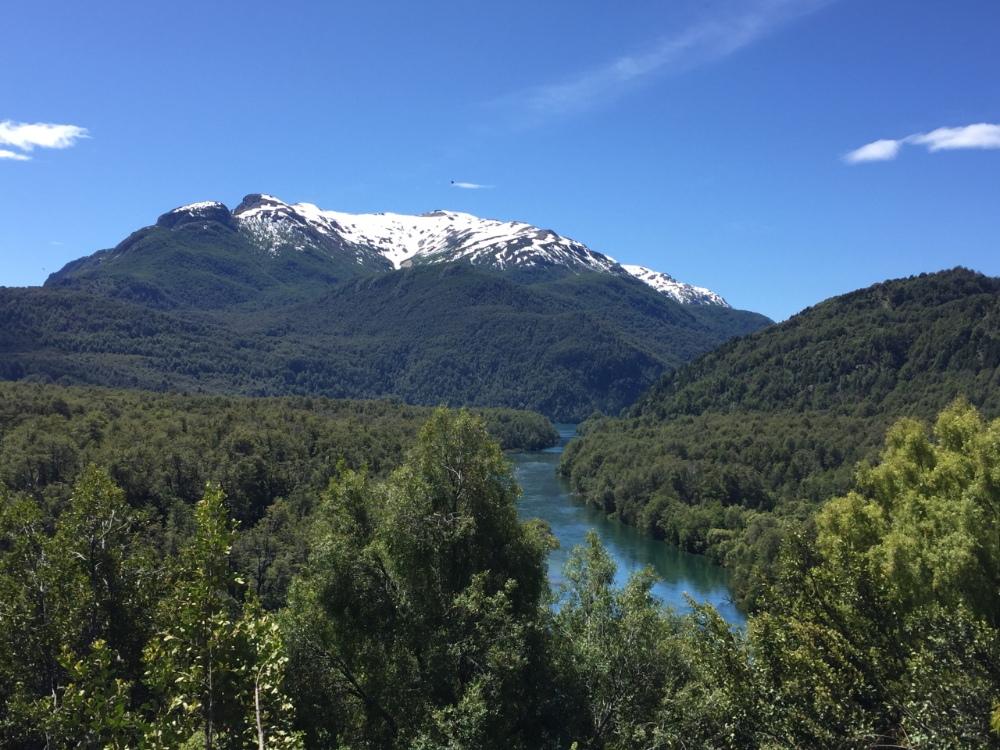
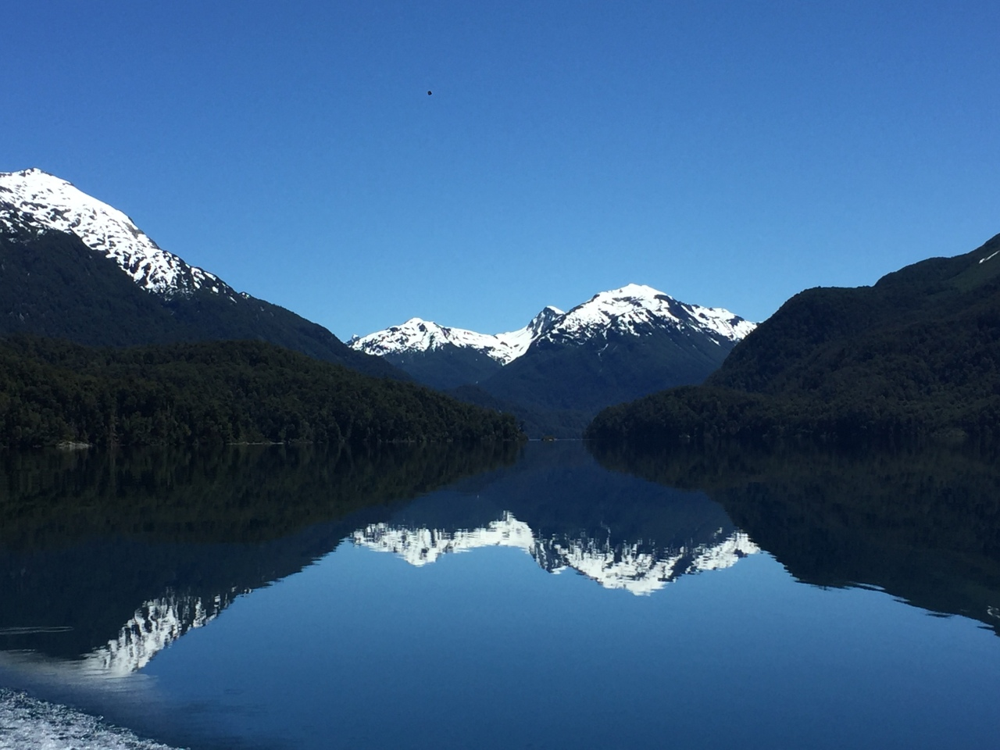
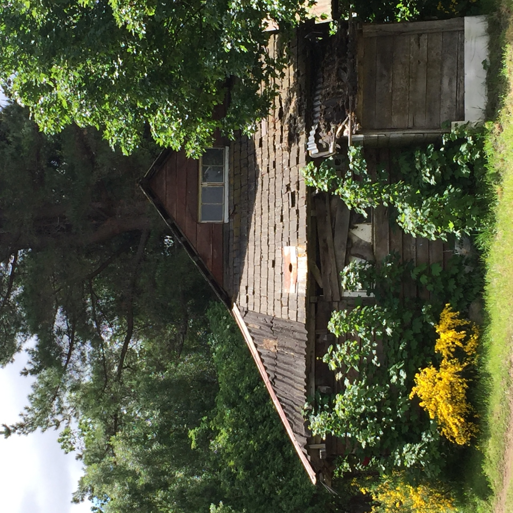
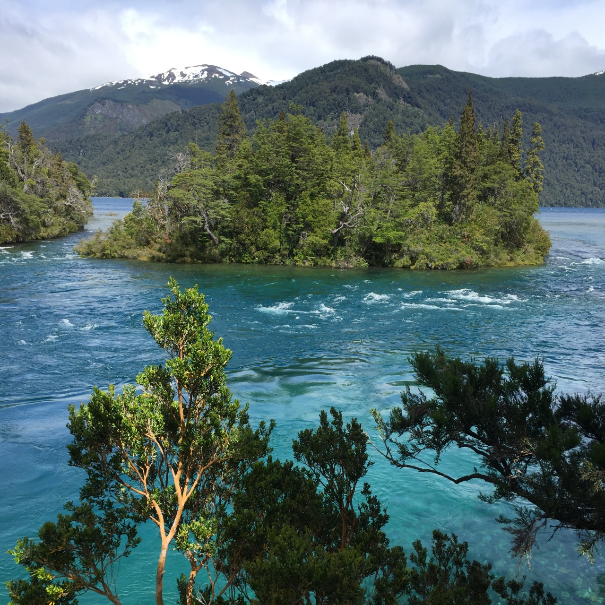

<iframe style="border: 0; width: 100%; height: 42px;" src="https://bandcamp.com/EmbeddedPlayer/album=469038166/size=small/bgcol=ffffff/linkcol=0687f5/track=2611238221/transparent=true/" seamless><a href="https://pepiamodeo.bandcamp.com/album/alerces">Alerces by Pepi Amodeo</a></iframe>

Black-faced ibis (_Theristicus melanopis_) in Villa Futalaufquen, a welcome. A dog barks in the distance.

<iframe style="border: 0; width: 100%; height: 42px;" src="https://bandcamp.com/EmbeddedPlayer/album=469038166/size=small/bgcol=ffffff/linkcol=0687f5/track=1818603113/transparent=true/" seamless><a href="https://pepiamodeo.bandcamp.com/album/alerces">Alerces by Pepi Amodeo</a></iframe>

House Wren (_Troglodytes aedon_), up close.

<iframe style="border: 0; width: 100%; height: 42px;" src="https://bandcamp.com/EmbeddedPlayer/album=469038166/size=small/bgcol=ffffff/linkcol=0687f5/track=4042333825/transparent=true/" seamless><a href="https://pepiamodeo.bandcamp.com/album/alerces">Alerces by Pepi Amodeo</a></iframe>

In Villa Futalaufquen, the Patagonian wind impacts European poplar trees.

<iframe style="border: 0; width: 100%; height: 42px;" src="https://bandcamp.com/EmbeddedPlayer/album=469038166/size=small/bgcol=ffffff/linkcol=0687f5/track=3009332904/transparent=true/" seamless><a href="https://pepiamodeo.bandcamp.com/album/alerces">Alerces by Pepi Amodeo</a></iframe>

Hiking on a trail through reed beds beneath the canopy of Dombey's beeches.

<iframe style="border: 0; width: 100%; height: 42px;" src="https://bandcamp.com/EmbeddedPlayer/album=469038166/size=small/bgcol=ffffff/linkcol=0687f5/track=2438782256/transparent=true/" seamless><a href="https://pepiamodeo.bandcamp.com/album/alerces">Alerces by Pepi Amodeo</a></iframe>

Irigoyen Waterfall recorded from above.

<iframe style="border: 0; width: 100%; height: 42px;" src="https://bandcamp.com/EmbeddedPlayer/album=469038166/size=small/bgcol=ffffff/linkcol=0687f5/track=2227089749/transparent=true/" seamless><a href="https://pepiamodeo.bandcamp.com/album/alerces">Alerces by Pepi Amodeo</a></iframe>

Cascada River. A common diuca finch (_Diuca diuca_) sings in the foreground. Chainsaws and other birds in the distance.

<iframe style="border: 0; width: 100%; height: 42px;" src="https://bandcamp.com/EmbeddedPlayer/album=469038166/size=small/bgcol=ffffff/linkcol=0687f5/track=587328427/transparent=true/" seamless><a href="https://pepiamodeo.bandcamp.com/album/alerces">Alerces by Pepi Amodeo</a></iframe>

Hundreds of Patagonian thrushes (_Turdus falklandii_) create the texture of the dawn in a forest of Dombey's beeches, while other birds gradually appear.

<iframe style="border: 0; width: 100%; height: 42px;" src="https://bandcamp.com/EmbeddedPlayer/album=469038166/size=small/bgcol=ffffff/linkcol=0687f5/track=1834870318/transparent=true/" seamless><a href="https://pepiamodeo.bandcamp.com/album/alerces">Alerces by Pepi Amodeo</a></iframe>

Waves on the sandy shore at Playa Blanca, Lake Futalaufquen. Night.

<iframe style="border: 0; width: 100%; height: 42px;" src="https://bandcamp.com/EmbeddedPlayer/album=469038166/size=small/bgcol=ffffff/linkcol=0687f5/track=2243329694/transparent=true/" seamless><a href="https://pepiamodeo.bandcamp.com/album/alerces">Alerces by Pepi Amodeo</a></iframe>

European bumblebee (_Bombus terrestris_) exploring the undergrowth.

<iframe style="border: 0; width: 100%; height: 42px;" src="https://bandcamp.com/EmbeddedPlayer/album=469038166/size=small/bgcol=ffffff/linkcol=0687f5/track=2871134859/transparent=true/" seamless><a href="https://pepiamodeo.bandcamp.com/album/alerces">Alerces by Pepi Amodeo</a></iframe>

The Patagonian wind impacts the tops of the Dombey's beeches forest canopy. The creaking of the trunks creates suspense in the undergrowth.

<iframe style="border: 0; width: 100%; height: 42px;" src="https://bandcamp.com/EmbeddedPlayer/album=469038166/size=small/bgcol=ffffff/linkcol=0687f5/track=2981106985/transparent=true/" seamless><a href="https://pepiamodeo.bandcamp.com/album/alerces">Alerces by Pepi Amodeo</a></iframe>

From the Torrecillas Glacier, a stream of water runs through the scree field to Lake Menéndez.

<iframe style="border: 0; width: 100%; height: 42px;" src="https://bandcamp.com/EmbeddedPlayer/album=469038166/size=small/bgcol=ffffff/linkcol=0687f5/track=1486914212/transparent=true/" seamless><a href="https://pepiamodeo.bandcamp.com/album/alerces">Alerces by Pepi Amodeo</a></iframe>

A chucao (_Scelorchilus rubecula_) approaches slowly, and its song reverberates in the forest of Dombey's beeches.

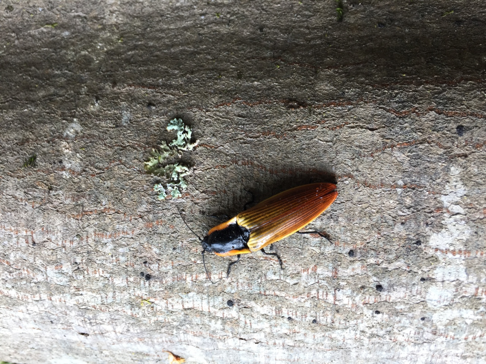
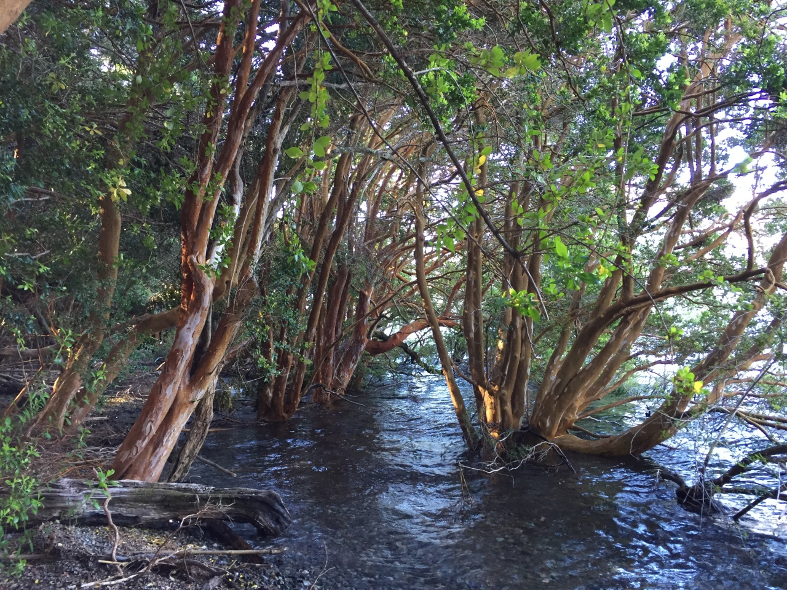

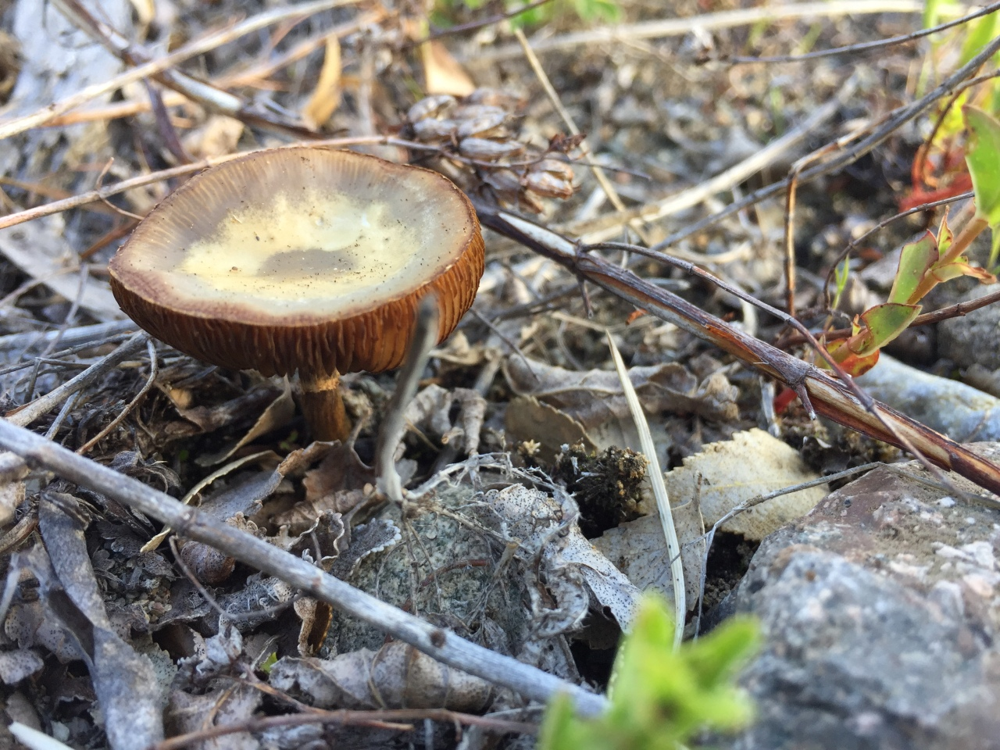
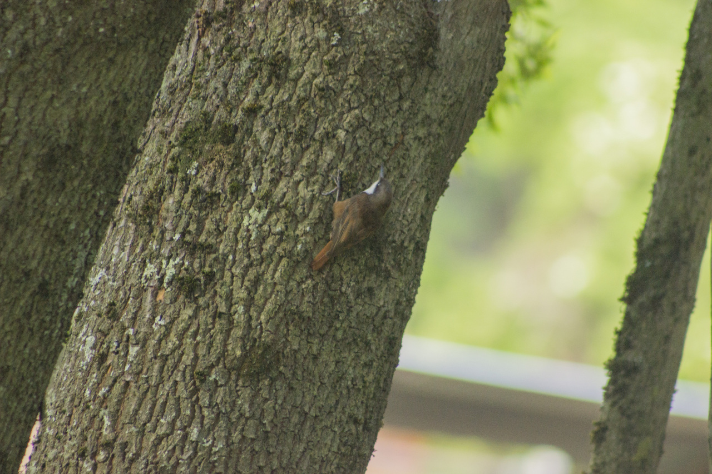

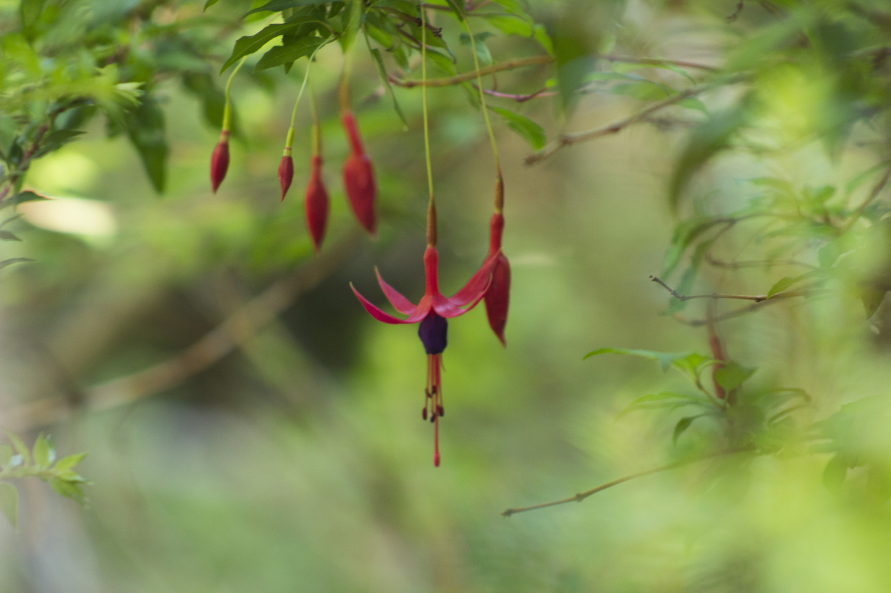
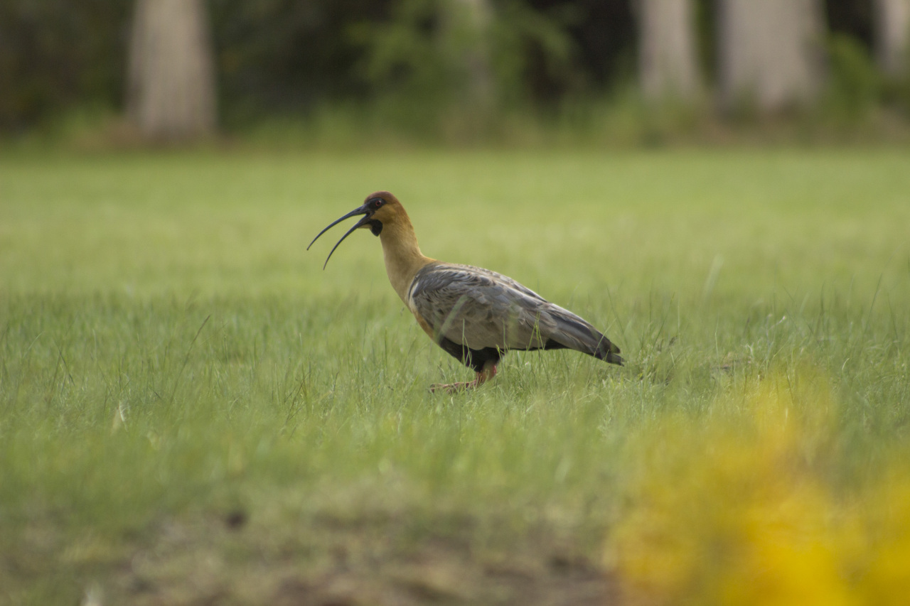

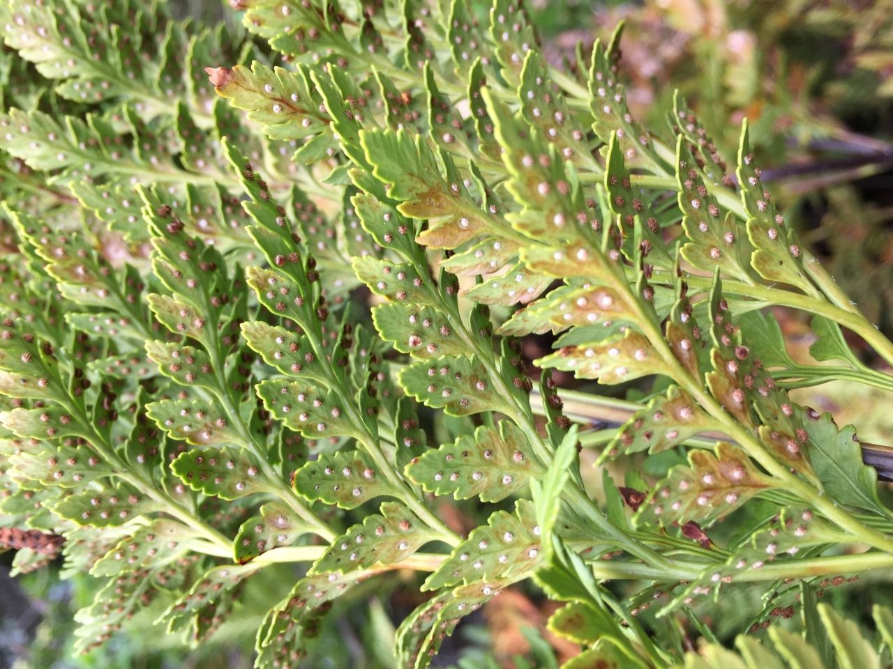
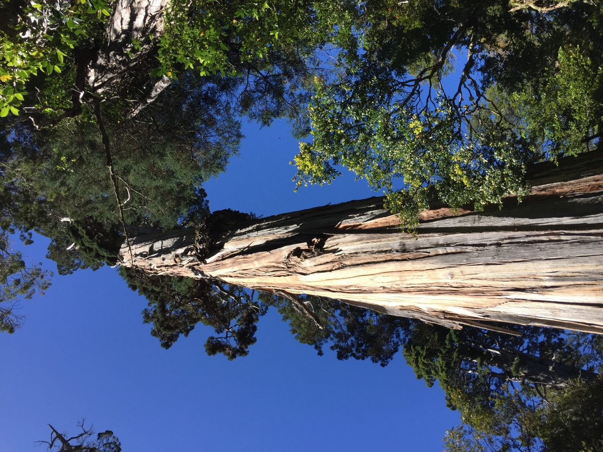

