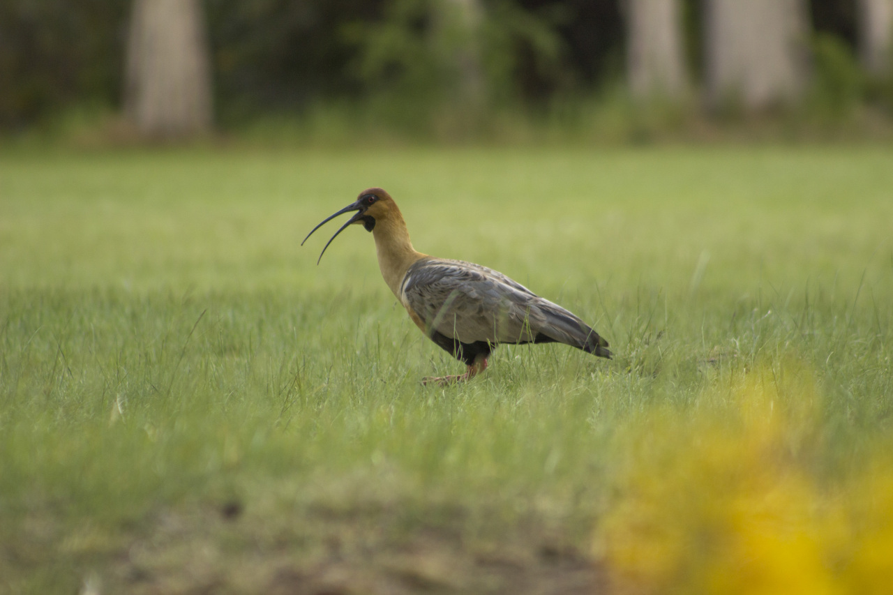
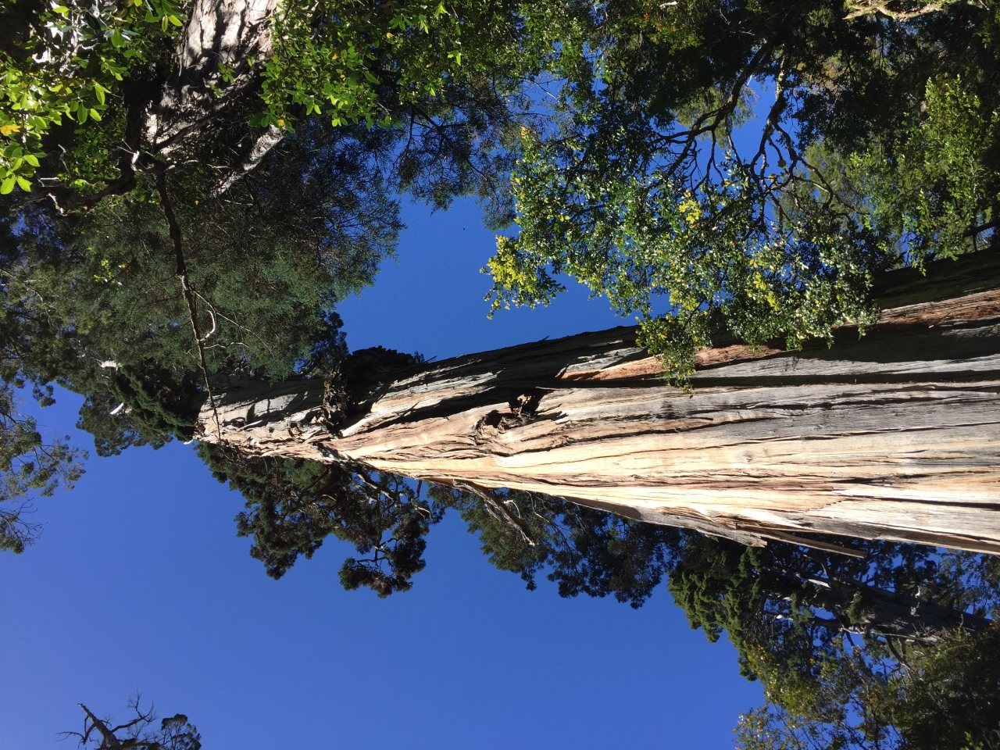

Idioma:

****

## Alerces
### 2023
#### Álbum de grabaciones de campo y paisajes sonoros
#### 12 pistas / 33:20 min

Alerces es una colección de grabaciones de campo realizadas en el Parque Nacional Los Alerces, un territorio de gran valor para la conservación del patrimonio natural y cultural de los ecosistemas patagónicos. Aves, insectos, vegetación nativa y exótica, viento y agua en distintos ambientes son algunos representantes de los paisajes sonoros de ese territorio. La cordillera de los Andes divide aguas que cruzan la estepa hasta llegar al Océano Atlántico y otras que encontrarán su paso a través de la montaña para llegar al Océano Pacífico. El agua es transversal a todos los paisajes generando multiplicidad de sonoridades según su estado y las texturas que encuentra a su camino. La producción de este álbum fue posible gracias al programa Residencias Artísticas en Parques Nacionales de la Administración de Parques Nacionales y el Ministerio de Cultura de la Nación Argentina (2022).

****

#### Bandurrias

<iframe style="border: 0; width: 100%; height: 42px;" src="https://bandcamp.com/EmbeddedPlayer/album=469038166/size=small/bgcol=ffffff/linkcol=0687f5/track=2611238221/transparent=true/" seamless><a href="https://pepiamodeo.bandcamp.com/album/alerces">Alerces by Pepi Amodeo</a></iframe>

Bandurrias (_Theristicus melanopis_) en Villa Futalaufquen, una bienvenida. Un perro ladra a lo lejos.

<iframe style="border: 0; width: 100%; height: 42px;" src="https://bandcamp.com/EmbeddedPlayer/album=469038166/size=small/bgcol=ffffff/linkcol=0687f5/track=1818603113/transparent=true/" seamless><a href="https://pepiamodeo.bandcamp.com/album/alerces">Alerces by Pepi Amodeo</a></iframe>

Ratona común (_Troglodytes aedon_), bien de cerca.

<iframe style="border: 0; width: 100%; height: 42px;" src="https://bandcamp.com/EmbeddedPlayer/album=469038166/size=small/bgcol=ffffff/linkcol=0687f5/track=4042333825/transparent=true/" seamless><a href="https://pepiamodeo.bandcamp.com/album/alerces">Alerces by Pepi Amodeo</a></iframe>

En Villa Futalaufquen, el viento patagónico incide sobre álamos de origen europeo.

<iframe style="border: 0; width: 100%; height: 42px;" src="https://bandcamp.com/EmbeddedPlayer/album=469038166/size=small/bgcol=ffffff/linkcol=0687f5/track=3009332904/transparent=true/" seamless><a href="https://pepiamodeo.bandcamp.com/album/alerces">Alerces by Pepi Amodeo</a></iframe>

Caminata en un sendero entre cañaverales bajo las copas de un bosque de coihues.

<iframe style="border: 0; width: 100%; height: 42px;" src="https://bandcamp.com/EmbeddedPlayer/album=469038166/size=small/bgcol=ffffff/linkcol=0687f5/track=2438782256/transparent=true/" seamless><a href="https://pepiamodeo.bandcamp.com/album/alerces">Alerces by Pepi Amodeo</a></iframe>

Cascada Irigoyen tomada desde arriba.

<iframe style="border: 0; width: 100%; height: 42px;" src="https://bandcamp.com/EmbeddedPlayer/album=469038166/size=small/bgcol=ffffff/linkcol=0687f5/track=2227089749/transparent=true/" seamless><a href="https://pepiamodeo.bandcamp.com/album/alerces">Alerces by Pepi Amodeo</a></iframe>

Río Cascada. Una diuca (_Diuca diuca_) canta en primer plano. Motosierras y otras aves a la distancia.

<iframe style="border: 0; width: 100%; height: 42px;" src="https://bandcamp.com/EmbeddedPlayer/album=469038166/size=small/bgcol=ffffff/linkcol=0687f5/track=587328427/transparent=true/" seamless><a href="https://pepiamodeo.bandcamp.com/album/alerces">Alerces by Pepi Amodeo</a></iframe>

Cientos de zorzales patagónicos (_Turdus falklandii_) generan la textura del amanecer en un bosque de coihues sobre la que van apareciendo otras aves.

<iframe style="border: 0; width: 100%; height: 42px;" src="https://bandcamp.com/EmbeddedPlayer/album=469038166/size=small/bgcol=ffffff/linkcol=0687f5/track=1834870318/transparent=true/" seamless><a href="https://pepiamodeo.bandcamp.com/album/alerces">Alerces by Pepi Amodeo</a></iframe>

Olas en la costa de arena en Playa Blanca, Lago Futalaufquen. Noche.

<iframe style="border: 0; width: 100%; height: 42px;" src="https://bandcamp.com/EmbeddedPlayer/album=469038166/size=small/bgcol=ffffff/linkcol=0687f5/track=2243329694/transparent=true/" seamless><a href="https://pepiamodeo.bandcamp.com/album/alerces">Alerces by Pepi Amodeo</a></iframe>

Abejorro (_Bombus terrestris_) recorriendo el sotobosque

<iframe style="border: 0; width: 100%; height: 42px;" src="https://bandcamp.com/EmbeddedPlayer/album=469038166/size=small/bgcol=ffffff/linkcol=0687f5/track=2871134859/transparent=true/" seamless><a href="https://pepiamodeo.bandcamp.com/album/alerces">Alerces by Pepi Amodeo</a></iframe>

El viento patagónico incide en lo alto de las copas del bosque de coihues. El rechinar de los troncos genera suspenso en el sotobosque.

<iframe style="border: 0; width: 100%; height: 42px;" src="https://bandcamp.com/EmbeddedPlayer/album=469038166/size=small/bgcol=ffffff/linkcol=0687f5/track=2981106985/transparent=true/" seamless><a href="https://pepiamodeo.bandcamp.com/album/alerces">Alerces by Pepi Amodeo</a></iframe>

Desde el glaciar Torrecillas, un hilo de agua corre por el pedredo hasta el lago Menéndez.

<iframe style="border: 0; width: 100%; height: 42px;" src="https://bandcamp.com/EmbeddedPlayer/album=469038166/size=small/bgcol=ffffff/linkcol=0687f5/track=1486914212/transparent=true/" seamless><a href="https://pepiamodeo.bandcamp.com/album/alerces">Alerces by Pepi Amodeo</a></iframe>

Un chucao (_Scelorchilus rubecula_) se acerca lentamente y su canto se percibe en la reverberancia del bosque de coihues.

